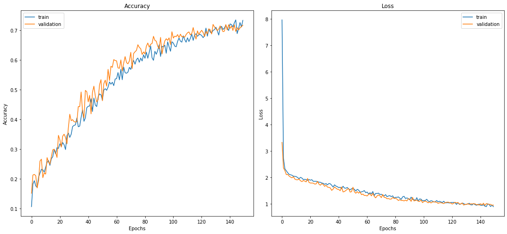
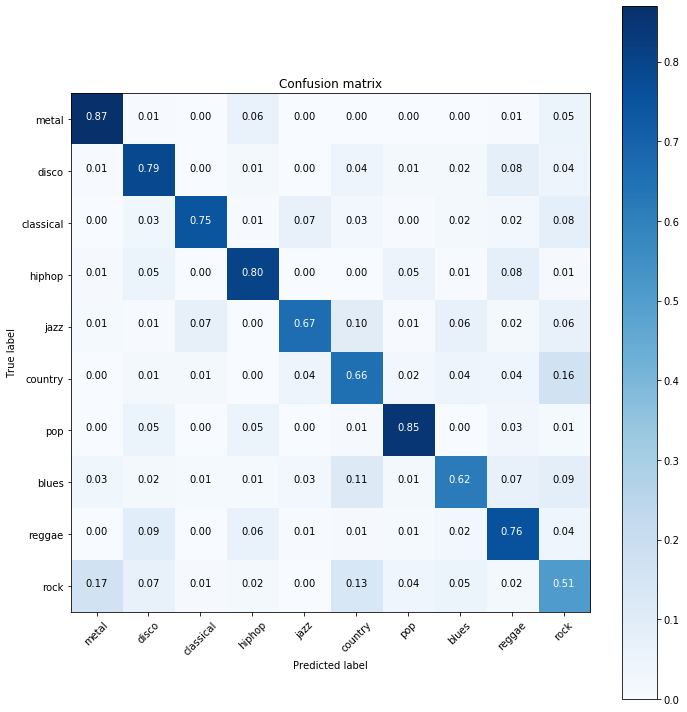
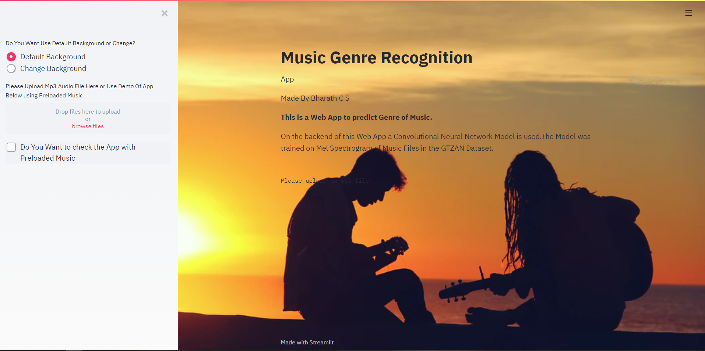
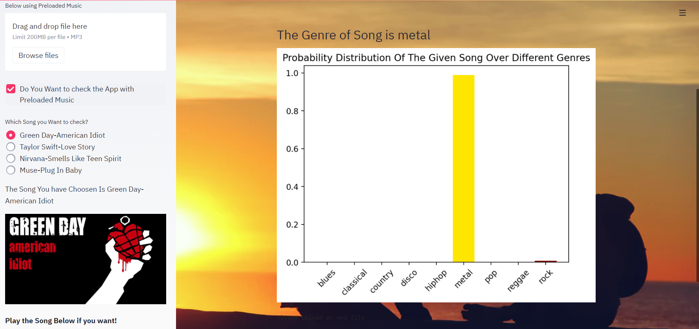

## Music Genre Classification

>  Music Genre classification using Convolutional Neural Networks. Implemented in Tensorflow 2.0 using the Keras API

### Overview

*tl;dr*: Compare the classic approach of extract features and use a classifier (e.g SVM) against the Deep Learning approach of using CNNs on a representation of the audio (Melspectrogram) to extract features and classify. You can see both approaches on the **nbs** folder in the Jupyter notebooks. 

Resume of the deep learning approach:

1. Shuffle the input and split into train and test (70%/30%)
2. Read the audios as melspectrograms, spliting then into 1.5s windows with 50% overlaping resulting in a dataset with shape (samples x time x frequency x channels)
3. Train the CNN and test on test set using a Majority Voting approach

### Results

To compare the result across multiple architectures, we have took two approaches for this problem: One using the classic approach of extracting features and then using a classifier. The second approach, which is implemented on the src file here is a Deep Learning approach feeding a CNN with a melspectrogram.

You can check in the nbs folder on how we extracted the features, but here are the current results on the test set:

| Model | Acc |
|-------|-----|
| Decision Tree | 0.5160 |
| Random Forest | 0.6760 |
| ElasticNet | 0.6880 |
| Logistic Regression | 0.7640 |
| SVM (RBF) | 0.7880 |

For the deep learning approach we have tested a simple custom architecture that can be found at the *nbs* folder. 

| Model | Acc |
|-------|-----|
| **CNN 2D** | **0.832** |




### Dataset

And how to get the dataset?

1. Download the GTZAN dataset [here](http://opihi.cs.uvic.ca/sound/genres.tar.gz)

Extract the file in the **data** folder of this project. The structure should look like this:

```bash
├── data/
   ├── genres
      ├── blues
      ├── classical
      ├── country
      .
      .
      .
      ├── rock
```

### How to run

The models are provided as **.joblib** or **.h5** files in the *models* folder. You just need to use it on your custom file as described bellow.

If you want to run the training process yourself, you need to run the provided notebooks in *nbs* folder.

To apply the model on a test file, you need to run:

```bash
$ cd src/
$ python app.py -t MODEL_TYPE -m ../models/PATH_TO_MODEL -s PATH_TO_SONG
```

Where MODEL_TYPE = [ml, dl] for classical machine learning approach and for a deep learning approach, respectively.

Usage example:

```bash
$ python app.py -t dl -m ../models/custom_cnn_2d.h5 -s ../data/samples/iza_meu_talisma.mp3
```

and the output will be:

```bash
$ ../data/samples/iza_meu_talisma.mp3 is a pop song
$ most likely genres are: [('pop', 0.43), ('hiphop', 0.39), ('country', 0.08)]
```

## Streamlit app

## Initial screen



## After selecting the music


